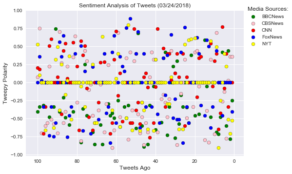
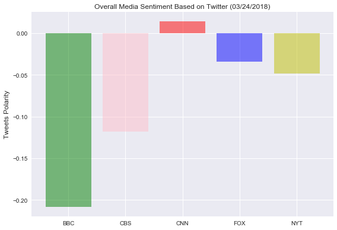

# ***Distinguishing Sentiments***

```python
# Trendings based on the most recent 100 tweets:
# 1. CNN news has the least bias;
# 2. BBC news have the most negative average sentiment scores;
# 3. Most of the news should be staying unbiased where sentiment scores equals 0
```


```python
# Dependencies
import tweepy
import json
import pandas as pd
import numpy as np
from datetime import datetime
import matplotlib.pyplot as plt
import matplotlib as mpl
from vaderSentiment.vaderSentiment import SentimentIntensityAnalyzer
analyzer = SentimentIntensityAnalyzer()
```


```python
from config import ConsumerKey, ConsumerSecret, AccessToken, AccessTokenSecret
# Twitter API Keys
consumer_key = ConsumerKey
consumer_secret = ConsumerSecret
access_token = AccessToken
access_token_secret = AccessTokenSecret

# Setup Tweepy API Authentication
auth = tweepy.OAuthHandler(consumer_key, consumer_secret)
auth.set_access_token(access_token, access_token_secret)
api = tweepy.API(auth)
```


```python
target_users = ['@BBCNews', '@CBSNews', '@CNN', '@FoxNews', '@NYT']
# Create a Dataframe for 5 news organizations
five_news_df = pd.DataFrame({"BBCNews":'',"CBSNews":'',"CNN":'',"FoxNews":'',"NYT":''}, index=[0])
```


```python
# loop through 5 new organizations
for user in target_users:
    i = 0 # row index for in five_news_df
    tweet_status = tweepy.Cursor(api.user_timeline, id=user)
    for status in tweet_status.items(100):
        # extract text and run Vader Analysis on each tweet
        compound = analyzer.polarity_scores(status.text)["compound"]
        
        # Add compound value to the dataframe
        five_news_df.set_value(i, user[1:], compound)
        i += 1 # next row

five_news_df.head(10)
```


<div>
<style>
    .dataframe thead tr:only-child th {
        text-align: right;
    }

    .dataframe thead th {
        text-align: left;
    }

    .dataframe tbody tr th {
        vertical-align: top;
    }
</style>
<table border="1" class="dataframe">
  <thead>
    <tr style="text-align: right;">
      <th></th>
      <th>BBCNews</th>
      <th>CBSNews</th>
      <th>CNN</th>
      <th>FoxNews</th>
      <th>NYT</th>
    </tr>
  </thead>
  <tbody>
    <tr>
      <th>0</th>
      <td>-0.4019</td>
      <td>0.0772</td>
      <td>0.2023</td>
      <td>0</td>
      <td>0.5267</td>
    </tr>
    <tr>
      <th>1</th>
      <td>-0.34</td>
      <td>0.7506</td>
      <td>0.1828</td>
      <td>0.3612</td>
      <td>0.1027</td>
    </tr>
    <tr>
      <th>2</th>
      <td>0</td>
      <td>-0.7003</td>
      <td>0</td>
      <td>0.0258</td>
      <td>0</td>
    </tr>
    <tr>
      <th>3</th>
      <td>-0.3182</td>
      <td>0</td>
      <td>-0.7096</td>
      <td>-0.34</td>
      <td>0</td>
    </tr>
    <tr>
      <th>4</th>
      <td>0</td>
      <td>-0.5994</td>
      <td>-0.34</td>
      <td>0</td>
      <td>-0.6597</td>
    </tr>
    <tr>
      <th>5</th>
      <td>0</td>
      <td>-0.5574</td>
      <td>0</td>
      <td>0</td>
      <td>0</td>
    </tr>
    <tr>
      <th>6</th>
      <td>-0.4767</td>
      <td>0.2263</td>
      <td>0.5106</td>
      <td>-0.7351</td>
      <td>0</td>
    </tr>
    <tr>
      <th>7</th>
      <td>0</td>
      <td>-0.5106</td>
      <td>0.5994</td>
      <td>-0.34</td>
      <td>0</td>
    </tr>
    <tr>
      <th>8</th>
      <td>-0.34</td>
      <td>-0.5719</td>
      <td>0</td>
      <td>-0.7506</td>
      <td>-0.6249</td>
    </tr>
    <tr>
      <th>9</th>
      <td>0.743</td>
      <td>0</td>
      <td>0</td>
      <td>-0.5574</td>
      <td>0.3182</td>
    </tr>
  </tbody>
</table>
</div>


```python
x_axis = np.arange(100,0,-1)
mpl.style.use('seaborn')
plt.grid(color = "white")
bbc = plt.scatter(x_axis, five_news_df['BBCNews'], facecolor = "green", edgecolors = "black")
cbs = plt.scatter(x_axis, five_news_df['CBSNews'], facecolor = "pink", edgecolors = "black")
cnn = plt.scatter(x_axis, five_news_df['CNN'],facecolor = "red", edgecolors = "black")
fox = plt.scatter(x_axis, five_news_df['FoxNews'], facecolor = "blue", edgecolors = "black")
nyt = plt.scatter(x_axis, five_news_df['NYT'], facecolor = "yellow", edgecolors = "black")
plt.title('Sentiment Analysis of Tweets (03/24/2018)',fontsize=12)
plt.xlabel("Tweets Ago",fontsize=12)
plt.ylabel('Tweepy Polarity',fontsize=12)
plt.gca().invert_xaxis()
plt.legend((bbc,cbs,cnn,fox,nyt),numpoints=1, loc='upper right', ncol=1, fontsize=8)
plt.text(-7,1,"Media Sources:",fontsize=12)
lgd = plt.legend(bbox_to_anchor=(1, 1))
plt.savefig('Sentiment_scatter_plot.png',bbox_extra_artists=(lgd,), bbox_inches='tight')
plt.show()
```





```python
# Average score for each news organization
bbc_avg = five_news_df['BBCNews'].mean()
cbs_avg = five_news_df['CBSNews'].mean()
cnn_avg = five_news_df['CNN'].mean()
fox_avg = five_news_df['FoxNews'].mean()
nyt_avg = five_news_df['NYT'].mean()
# set different color for each new organization
colors = ["g","pink",'r',"b","y"]
plt.bar(np.arange(5),[bbc_avg,cbs_avg,cnn_avg,fox_avg,nyt_avg], color = colors, alpha=0.5, align="edge")

tick_locations = [value+0.4 for value in np.arange(5)]
plt.xticks(tick_locations, ["BBC", "CBS", "CNN", "FOX", "NYT"])
# Add labels
plt.title('Overall Media Sentiment Based on Twitter (03/24/2018)',fontsize = 12)
plt.ylabel('Tweets Polarity',fontsize = 12)
# save image
plt.savefig('Sentiment_Avg.png',fontsize = 12)
plt.tight_layout()
plt.show()
```




